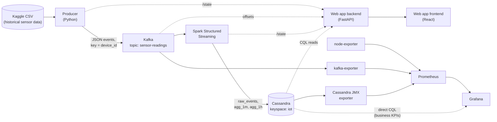

# Architecture

This document explains what the system is, how data moves through it, and what every
container/module does and why it exists. See `docs/PROJECT_STRUCTURE.md` for the
finer-grained, per-file version of this same explanation, `REQUIREMENTS.md` for the
frozen v1.0 specification this was built against, `docs/PROGRESS.md` for phase-by-phase
build history and implementation decisions, and `docs/TROUBLESHOOTING.md` for
non-obvious bugs found along the way. `docs/DEPLOYMENT.md` covers putting this on a VPS.

## What this is

A real, locally-deployable streaming sensor-data pipeline: a Python producer replays a
public IoT sensor dataset into Kafka at a configurable rate, then seamlessly switches to
synthetic data generation once the dataset is exhausted. Spark Structured Streaming
consumes the stream, validates it, flags statistical anomalies, computes 1-minute and
1-hour rollups, and writes everything to Cassandra. A guided web app lets a newcomer
click through each stage of the pipeline and watch it work with real, live numbers.
Grafana renders the operational and business KPIs. Everything runs as one
`docker compose up -d`.

## System overview

Solid arrows are the data path (what the pipeline actually processes). Dashed arrows
are read-only observation (state/metrics polling — nothing on a dashed path can affect
the data path).

**Data path (happy flow):**
1. The producer reads the Kaggle CSV top-to-bottom and publishes one JSON event per row
   to Kafka at a configurable rate. When the file is exhausted it switches — instantly
   and with the identical schema — to generating synthetic events forever.
2. Kafka distributes events across 3 partitions keyed by `device_id`, so per-device
   ordering is preserved.
3. Spark consumes in 30-second micro-batches: validates/enriches events, runs
   rule-based + adaptive-EWMA anomaly detection, and computes 1-minute and 1-hour
   windowed aggregates per device and per metric.
4. Spark writes raw events and both aggregate tables to Cassandra.
5. The web app backend polls the producer's and Spark's live-state endpoints plus
   Kafka and Cassandra directly, and streams a combined snapshot to the browser over
   WebSocket (falling back to polling).
6. Prometheus scrapes the exporters (Kafka, Cassandra/JMX, host); Grafana renders
   operational KPIs from Prometheus and business KPIs (anomaly counts, aggregates)
   read directly from Cassandra.

## Module-by-module

Every service below is defined in the root `docker-compose.yml`. "Internal port" is
what other containers use to reach it (Docker's built-in DNS resolves service names);
"host port" is what's published to the machine running Compose, controlled by the
matching `*_PORT` variable in `.env`.

### Ingestion

**`dataset-init`** — a one-shot container (own directory `kaggle_repository/`) that
downloads the public Kaggle dataset (`garystafford/environmental-sensor-data-132k`,
~62 MB, not committed to the repo) into a named volume (`kaggle_dataset`) before
`producer`/`spark-job`/`spark-worker` start — same idiom as `kafka-topic-init`/
`cassandra-schema-init`. Idempotent: skips the download entirely if the volume already
has the file, so it costs nothing on restarts. Needs no credentials for this dataset
in the common case (it's public); `KAGGLE_USERNAME`/`KAGGLE_KEY` in `.env` are an
optional fallback only, in case Kaggle ever requires auth for it.

**`producer`** — *the only thing that writes to Kafka.*
Own directory `producer/` (Python, `confluent-kafka`). Streams
`iot_telemetry_data.csv` (from the `kaggle_dataset` volume) row by row at
`PRODUCER_RATE_MSGS_PER_SEC` (default 100 msg/s), building one canonical JSON event
per row (`producer/producer/schema.py`) and publishing it with `device_id` as the
Kafka key. Once the file is exhausted it hands over to a synthetic generator
(`producer/producer/synthetic.py`) that samples from the same per-device statistical
baseline forever, occasionally injecting exaggerated anomalies
(`PRODUCER_ANOMALY_PROBABILITY`) so the pipeline's anomaly detection has something real
to catch. Exposes `GET /state` (mode, counters, hand-over timestamp) and `GET /metrics`
(Prometheus text) on internal port 8000 (host: `PRODUCER_STATE_PORT`, default 8001) —
read-only telemetry, no control surface yet. `kafka-volume-init` and `kafka-topic-init`
are tiny one-shot containers that fix volume ownership and create the Kafka topic
before the producer starts; they exit immediately and are expected to show
`Exited (0)`.

### Message broker

**`kafka`** — Apache Kafka in KRaft mode (no separate ZooKeeper), topic
`sensor-readings`, 3 partitions, replication factor 1 (single broker locally). Internal
port `19092` (what every other container uses), external port `9092`→host
`KAFKA_EXTERNAL_PORT` for tools running outside Docker. Data persists in the named
volume `kafka_data`.

**`kafka-ui`** — a dev-convenience web UI (`provectuslabs/kafka-ui`) for browsing
topics/messages by hand. Not part of the data or observation path; safe to leave off
in production (see `docs/DEPLOYMENT.md`).

### Stream processing

**`spark-master`** / **`spark-worker`** — a minimal Spark standalone cluster (one
master, one worker). `spark-worker` builds a custom image
(`spark_job/worker.Dockerfile`) because Structured Streaming's pandas UDF
(`applyInPandasWithState`, used for the adaptive anomaly baseline) actually executes on
the **worker**, not the driver — the worker needs the same `pandas`/`pyarrow` install
as the job itself.

**`spark-job`** — *the driver.* Own directory `spark_job/` (PySpark). Runs three fully
independent Structured Streaming queries against the same Kafka topic, each with its
own checkpoint (named volume `spark_checkpoints`, mounted on both `spark-job` and
`spark-worker` since state-store data is written by executors):
- **`raw_events`** — validates and enriches every event, detects anomalies (a static
  3-sigma-style rule plus a per-device/per-metric adaptive EWMA baseline seeded from
  the CSV), and writes one row per event to Cassandra with a stamped `write_ts`.
- **`agg_1m`** / **`agg_1h`** — tumbling-window aggregates (avg/max per metric, anomaly
  counts) per device, written to their own Cassandra tables.

Exposes the same `/state` + `/metrics` + `/healthz` pattern as the producer (internal
port 8000, host `SPARK_JOB_STATE_PORT`, default 8002), fed by a custom
`StreamingQueryListener` — Spark's own REST API (port 4040, also published for manual
inspection) doesn't expose Structured Streaming query progress as JSON.

### Storage

**`cassandra`** — Apache Cassandra 4.1, single node locally, keyspace `iot`. Builds a
custom image (`infra/cassandra/Dockerfile`) that bakes in a jmx_exporter javaagent so
Cassandra's own JVM metrics reach Prometheus without a sidecar. Three tables
(`infra/cassandra/schema/*.cql`, applied once by the `cassandra-schema-init` one-shot
container):
- **`raw_events`** — partitioned by `(device_id, 15-minute bucket)` to bound partition
  size under sustained write load; every sensor reading plus `is_anomaly`/
  `anomaly_reason`/`write_ts`.
- **`agg_1m`** / **`agg_1h`** — partitioned by `(device_id, day)` / `(device_id, month)`;
  the pre-computed rollups Grafana's business-KPI panels read directly.

No retention/TTL by design (NFR-4: keep everything) — disk usage grows unboundedly, so
disk-growth monitoring (Grafana KPI-4) and adequate disk sizing matter.

### Web app (P5)

**`backend`** — Own directory `backend/` (FastAPI). A **read-only** API and WebSocket
server — it never writes to Kafka or Cassandra, it only observes. Two background loops
poll the producer's and Spark's `/state` endpoints, Kafka's broker offsets (via its own
lightweight, commit-free Kafka consumer, used only to sample recent event content and
compute lag), and Cassandra (single-partition point reads for "recent rows", derived
from real observed event timestamps rather than wall-clock time — replay-mode events
carry historical dates). The result is broadcast to every connected browser over
`/ws/pipeline-state`; `GET /api/pipeline-state` and `GET /api/steps/{name}` serve the
same data over plain HTTP as a fallback. A hand-rolled HMAC-signed session cookie
(`backend/app/auth.py`) gates every data route — one static admin credential
(`BACKEND_ADMIN_USERNAME`/`PASSWORD`), no user table. `GET /api/anomalies` powers the
anomaly drill-down (same query pattern as Grafana's own anomaly panel). The frontend's
built static files are baked into this same image and served from `/` — see
"One combined container" below.

**`frontend`** — Own directory `frontend/` (React + TypeScript + Vite + Apache
ECharts). A six-step guided walkthrough (Deployment → Ingestion → Kafka → Spark →
Cassandra → Summary) matching the data path 1:1, plus a live custom SVG pipeline-flow
diagram with a REPLAY/SYNTHETIC hand-over badge. Not run as its own container in
production — see below.

**One combined container.** `backend/Dockerfile` is multi-stage: a Node stage builds
the React app, and the final Python stage serves the built files via FastAPI's
`StaticFiles` alongside the API, in one image/one container — matching
`REQUIREMENTS.md` §4.1's "Web app (API + frontend)" as a single deployable unit. This
is why the `backend` service's build `context:` in `docker-compose.yml` is the **repo
root**, not `./backend` like every other service — the Dockerfile needs to `COPY
frontend/...` from a sibling directory.

### Observability

**`prometheus`** — scrapes `kafka-exporter`, the Cassandra JMX exporter (baked into
the `cassandra` container), `node-exporter`, and the producer's/Spark job's own
`/metrics` endpoints. Config: `infra/prometheus/prometheus.yml` (requires
`docker compose restart prometheus` after editing — no hot reload).

**`kafka-exporter`** — broker-side Kafka metrics (partition offsets, consumer lag
inputs) for Prometheus.

**`node-exporter`** — host-level metrics (disk, CPU, memory) so Grafana can chart disk
growth against NFR-3/NFR-4's unbounded-retention risk.

**`grafana`** — builds a custom image (`infra/grafana/Dockerfile`) with the
`hadesarchitect-cassandra-datasource` plugin baked in, since half the KPI catalogue
(business metrics: anomaly counts, aggregates) is read directly from Cassandra, not
Prometheus. Dashboards and both datasources auto-provision from
`infra/grafana/provisioning/` — no manual clicking required after first start. Admin
credentials are a required env var with no default (`GRAFANA_ADMIN_PASSWORD`).

## Data flow summary

| Stage | Writes to | Reads from |
|---|---|---|
| Producer | Kafka (`sensor-readings`) | Kaggle CSV (once, at startup, for baseline stats) |
| Spark job | Cassandra (`raw_events`, `agg_1m`, `agg_1h`) | Kafka |
| Web app backend | *(nothing — read-only)* | Producer `/state`, Spark `/state`, Kafka offsets, Cassandra |
| Prometheus | its own TSDB | The 4 exporters/metrics endpoints |
| Grafana | *(nothing — read-only)* | Prometheus, Cassandra (direct CQL) |

Only the producer and the Spark job ever write to the systems that hold pipeline data
(Kafka, Cassandra). Everything else — the web app, Prometheus, Grafana — is a pure
observer, which is why none of it needs write credentials to anything and why it's
always safe to restart, scale, or (per NFR-6) put behind a login without touching the
data path.

## Security model (current phase)

Per NFR-6 (local/single-host phase): the web app and Grafana both require login; no
port is exposed beyond what's documented in `.env.example`; no secret is committed to
the repository (`.env` is gitignored; every credential/session-secret env var is a
required `${VAR:?...}` with no default, so the stack refuses to start with a placeholder
secret). Traffic between the browser and the app is plain HTTP by default — acceptable
for local development, **not** for a public VPS without the TLS hardening step in
`docs/DEPLOYMENT.md`. Full hardening (TLS, SSO, firewalled inter-node traffic) is
`REQUIREMENTS.md`'s Phase 6 (3-VPS k3s cluster) scope, not this local/single-VPS
deployment — see that document's §4.1 and §8 NFR-11 for the eventual production target.

## Supply-chain security

All three Python services (`producer`, `spark_job`, `backend`) install from
`requirements.txt` files generated by `pip-compile --generate-hashes` and installed
with `pip install --require-hashes` — every dependency (direct and transitive) is
pinned to an exact version with a verified hash. The frontend uses an explicit,
minimal dependency allowlist (`react`, `react-dom`, `vite`, `echarts`, plus
`typescript` — see `frontend/README.md` for that addition's justification),
`ignore-scripts=true` in `.npmrc`, and a committed, exact-pinned `package-lock.json`.
See `REQUIREMENTS.md` NFR-10 for the full policy this follows.
